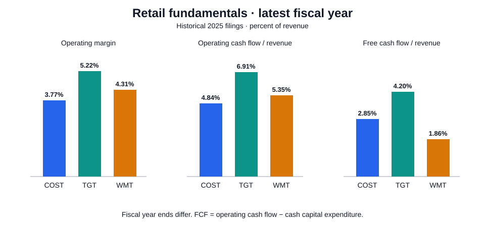

# Financial Research Projects

**Featured research:** [Earnings Quality and Future Cash Flow](earnings-quality-lab/) — SEC filing extraction, 20-company annual panel, label-availability-aware prediction, model comparisons, and grouped uncertainty checks.

## Retail Fundamentals Research

**Companion project:** [Sector Portfolio Risk Lab](sector-risk-lab/) — 10-industry walk-forward allocation, transaction costs, drawdowns, VaR, and paired block-bootstrap uncertainty.

**Why can free cash flow rise while operating performance weakens?** A small, reproducible company-analysis project comparing Walmart, Target, and Costco using historical annual-report data, Python, and SQLite.

[Research note](reports/RESEARCH_NOTE.md) · [Calculated results](reports/SNAPSHOT.md) · [SQL](sql/metrics.sql) · [Sources](data/sources.json)



## Scope

Three companies, three fiscal years each, nine source-linked observations. This first version is a deliberately small financial-statement study, built in October 2026 from reports published in 2025. It is not a current-data feed, predictive model, or trading backtest.

The project examines revenue growth, operating profitability, and the cash-flow bridge from operating cash flow to capital expenditure and free cash flow. A higher FCF number can come from reduced investment; the bridge helps distinguish the two.

## Run locally

Python 3.11 or later:

```bash
python -m venv .venv
source .venv/bin/activate
python -m pip install -r requirements.txt
python analyze.py
python -m unittest -v
```

On Windows PowerShell, activate with `.venv\Scripts\Activate.ps1`.

The curated data is bundled, so analysis runs offline after dependency installation. Tested with Python 3.12.14, Matplotlib 3.10.8, and the standard-library SQLite engine. Generated CSV, Markdown, JSON, and SVG outputs are committed for immediate review; the local SQLite database is regenerated and ignored by Git.

## How the analysis works

1. **Extract and document.** Manually transcribe four annual financial-statement fields and record each source URL, statement name, revenue definition, period end, and week count where applicable.
2. **Validate.** Check schema, integer amounts, unique company-years, source IDs, period order, positive revenue, and the capex sign convention.
3. **Query.** Load a typed SQLite table. Use `LAG` partitioned by company for year-over-year comparisons. Missing intervening years produce a missing growth rate, not a misleading YoY number.
4. **Interpret.** Export margins and a cash-flow bridge, then discuss accounting and calendar limitations in the research note.

| Measure | Definition |
| --- | --- |
| Revenue growth | Current / previous consecutive fiscal-year revenue − 1 |
| Operating margin | Operating income / revenue |
| CFO margin | Operating cash flow / revenue |
| Capex intensity | Cash capital expenditure / revenue |
| Free cash flow | Operating cash flow − cash capital expenditure |
| FCF margin | Free cash flow / revenue |
| Change in FCF | Change in CFO − change in capex |

Amounts are **USD millions**. Ratios in the output use **percentage points as their numeric unit**: `5.0` represents 5%, not 0.05. Capex is a positive outflow. FCF is a project-defined non-GAAP measure, not net income or cash available without restriction.

## Repository

| File | Purpose |
| --- | --- |
| `data/financials.csv` | Frozen, manually curated statement extract |
| `data/sources.json` | Source URLs and accounting/calendar notes |
| `analyze.py` | Validation, database loading, exports, chart |
| `sql/metrics.sql` | Window functions, ratios, and cash-flow bridge |
| `test_analyze.py` | Reconciliation and edge-case tests |
| `reports/` | Computed tables, chart, audit, and interpretation |
| `WALKTHROUGH_ZH.md` | Chinese walkthrough and interview preparation |

## Comparability limits

- Fiscal year labels are not calendar-year labels. Walmart FY2025 ends January 31, 2025; Target FY2024 ends February 1, 2025; Costco FY2025 ends August 31, 2025.
- Target FY2023 and Costco FY2023 have 53 weeks. Growth is reported as filed, with no invented 52-week adjustment.
- Walmart and Costco revenue includes membership-related income. Target's FY2024 report presents former sales and other revenue together as Net Sales and applies that presentation to comparative periods.
- Currency effects, acquisitions, working-capital movements, and differences in business models are not controlled. Three annual observations per company cannot establish a causal relationship or forecast returns.
- These are later-retrieved historical filings, not a point-in-time dataset suitable for a backtest. A production extension would record filing availability, amendments, and restatements separately.

## Development

Personal research project with AI-assisted development and analysis. Created in October 2026. The committed outputs are reproducible from the bundled data. The next substantive extensions are a reviewed SEC-data ingestion layer and a larger company panel with explicit filing-availability dates.
