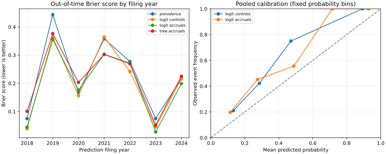

# Earnings Quality and Future Cash Flow

**Does the gap between reported profit and operating cash flow help predict next-year cash-flow deterioration?** An accession-aware SEC data pipeline and an out-of-time predictive study of 20 selected US consumer companies.

[Results](reports/RESULTS.md) · [Temporal audit](reports/fold_audit.csv) · [Predictions](reports/predictions.csv) · [Research design](design.json) · [Chinese walkthrough](WALKTHROUGH_ZH.md)



## What is substantive here

This project goes beyond a ratio dashboard. It reconstructs annual observations from specific SEC filing accessions, compares nested predictive models, enforces **outcome availability at training time**, and checks whether a claimed gain survives accounting-definition and target-denominator changes.

Created in October 2026 as a personal project with AI-assisted implementation, analysis, and documentation. It is not past internship work, an independently validated investment strategy, or a claim of unaided authorship.

## Current evidence

- 20 purposively selected consumer/retail companies; **267 annual records**, **237 consecutive-period labeled observations**.
- **130 out-of-time predictions** for filings in 2018–2024; 42 observed deterioration events.
- Brier score: training-prevalence baseline **0.2311**, logistic controls **0.2050**, logistic controls plus accruals **0.1977**, shallow tree **0.2186**.
- Adding accruals reduces pooled Brier error by 0.0073, but both company- and year-resampled intervals cross zero. **Stable incremental predictive value is not established.**
- Restricting the income definition or changing the denominator reduces the apparent gain. See [sensitivity results](reports/sensitivity.csv). More complex modeling did not automatically improve the result.

Brier score is the mean squared error of a probability forecast: lower is better. This is a prediction of a financial-statement ratio, **not stock returns**.

## Run offline

Python 3.11+:

```bash
cd earnings-quality-lab
python -m venv .venv
source .venv/bin/activate
python -m pip install -r requirements.txt
python research.py
python -m unittest -v
```

Windows PowerShell: `.venv\Scripts\Activate.ps1`. All compact source extracts and outputs are committed. SHA-256 checks reject modified input snapshots. `environment.json` records the environment used for the committed run; dependency ranges are not a lockfile.

Refresh into a separate directory, identifying your application and real contact address:

```bash
python download_data.py --user-agent 'Your research application your@email.example' --output data_refresh
```

The refresh preserves this study's fixed filing cutoff of 2025-12-31. The downloader is sequential with at least 0.25 seconds between new requests, caches full responses outside version control, and refuses to overwrite an existing extract directory. Cached responses retain their original retrieval timestamps. A refresh may differ because SEC's current aggregation can change.

## Financial construction

| Item | Definition |
| --- | --- |
| Period | Annual duration of 350–380 elapsed days; original form 10-K; filed 1–180 days after period end |
| CFO | `NetCashProvidedByUsedInOperatingActivities`, USD, exact annual start/end |
| Income | `ProfitLoss` when available; otherwise `NetIncomeLoss`; exact annual start/end |
| Assets | `Assets`, USD, instant at the same period end and in the same accession |
| Accruals proxy | `(income - CFO) / end-of-year assets` |
| Controls | `CFO / end assets` and `log(end assets)` |
| Primary target | Next annual CFO/assets minus current annual CFO/assets < -0.02 |

`ProfitLoss` includes noncontrolling interests; `NetIncomeLoss` is attributable to the parent. They are **not identical definitions**. The selected tag is recorded in every row, and a consolidated-income-only sensitivity is included. This simple cash-flow accruals proxy is not the balance-sheet accruals formula or a direct implementation of a published stock-return anomaly.

The earliest timely original filing is selected for each period. All required facts must exist in that same accession; conflicting values cause exclusion. An incomplete original is not silently replaced with a later, revised comparative disclosure. Eight periods are excluded for missing income tags; see [exclusions](reports/exclusions.csv). Missing annual pairs are not bridged. Current and next accounting periods must be contiguous. Raw values are USD, not millions.

## Temporal validation

1. At January 1 of each test filing year, build a training sample whose **next-year outcome was already filed before that date**.
2. Fit preprocessing and models only on those training rows.
3. Predict when each test company's current 10-K is filed during that year. Do not update the model during the year.
4. Evaluate against the next annual report once available, subject to the fixed source cutoff.

This is stricter than merely splitting by the date of the feature filing: an older feature row's future label may still be unavailable. Same-day filings are excluded from the training boundary. Filed dates have daily resolution; no intraday tradability is claimed. A portion of the next fiscal year has already elapsed by the current filing date.

Models: training prevalence; standardized logistic regression using controls; the same regression plus accruals; a depth-2 decision tree. Hyperparameters are fixed, there is no parameter search, and all comparisons are reported. `design.json` was written before the first model run, with coverage changes documented before fitting; this is not externally registered preregistration. The two diagnostic sensitivities were added after inspecting the primary run and are explicitly exploratory.

## Uncertainty and failure analysis

- Two paired bootstraps with 2,000 resamples: whole-company clusters and, separately, whole-prediction-year clusters.
- Each preserves one dependence structure; neither handles company and year clustering simultaneously. Seven year clusters are especially few.
- Intervals condition on fitted forecasts; models are not refit inside resamples, and selection/multiple-testing uncertainty is not included.
- Calibration bins are fixed at width 0.2. Counts are included because small bins can mislead.
- No-positive-outcome years have missing ranking metrics. Wrong zero-probability tree forecasts are penalized heavily by log loss.
- The last test year's two smallest and two largest prediction errors are exported as [case studies](reports/case_studies.csv); this retrospective selection illustrates successes and failures rather than proving performance.

## Files

| Path | Purpose |
| --- | --- |
| `download_data.py` | Rate-limited SEC download, cache, compact extracts and hashes |
| `research.py` | Extraction, features, label timing, models, validation and reports |
| `test_research.py` | Temporal leakage, period consistency, conflict and bootstrap tests |
| `data/universe.csv` | Fixed, explicitly selected company cohort and CIKs |
| `data/sec/manifest.json` | SEC URLs, retrieval dates and raw/extract hashes |
| `reports/annual_facts.csv` | Accepted observations, exact accessions and filing links |
| `reports/labeled_panel.csv` | Matched next-year outcomes and availability dates |
| `reports/fold_audit.csv` | Train/test counts and latest available training-label dates |
| `reports/metrics.csv` | Full-sample out-of-time model comparison |
| `reports/year_metrics.csv` | Year-specific performance |
| `reports/coefficients.csv` | Fold-specific standardized logistic coefficients |
| `reports/sensitivity.csv` | Income-definition and target-denominator checks |
| `reports/uncertainty.json` | Paired bootstrap differences and intervals |

## Limits and next research steps

The universe consists of familiar surviving firms selected in 2026. It excludes failed/delisted firms and cannot estimate performance in a historical investable universe. Missing XBRL tags create further selection. The annual sample is small, companies recur across folds, and common economic shocks affect multiple firms. Acquisitions, discontinued operations, lease accounting, and asset growth can change ratios without deteriorating underlying operations. Fiscal calendars and 52/53-week years are not normalized.

These are later-downloaded SEC facts selected by accession and filing date, not a certified archive of everything an investor could have observed at each historical moment. Custom tags, amendments and full footnote contexts are not reconstructed. Results reflect this extraction policy. No fraud, causation, alpha, investment recommendation or hiring outcome is established.

Useful next steps: review a stratified sample against original filing tables; expand to a historically defined cohort including failures; add explicit accounting-tag bridges; then evaluate a separately frozen later period. Increasing model complexity is not the next priority.

Source: [SEC EDGAR API documentation](https://www.sec.gov/search-filings/edgar-application-programming-interfaces). Company Facts supplies standard-taxonomy entity-level facts; it does not eliminate accounting comparability problems. No SEC affiliation or endorsement is implied.
