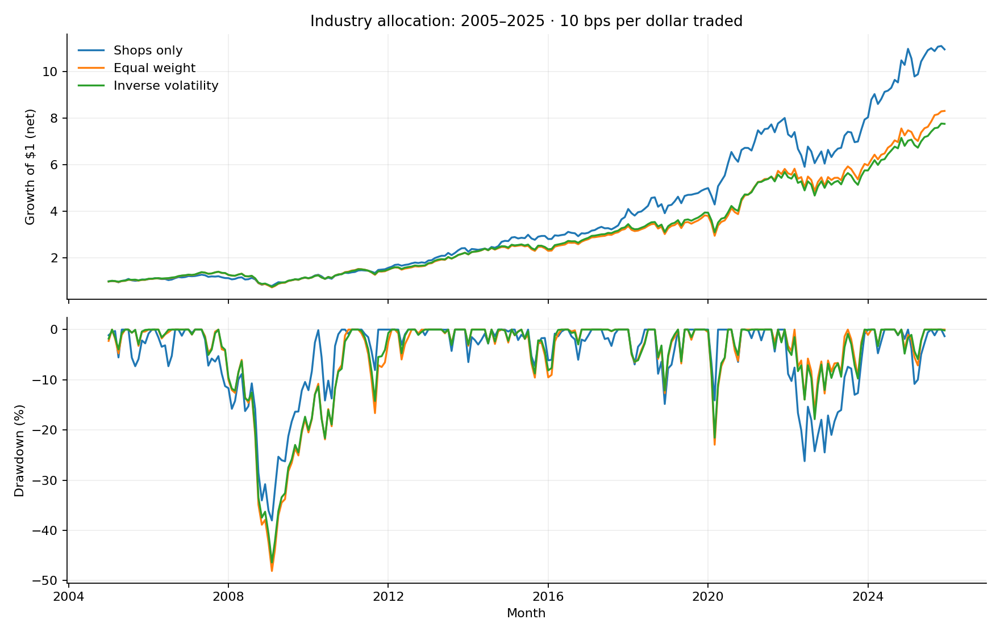

# Sector Portfolio Risk Lab

**Does allocating less to historically volatile industries actually reduce portfolio risk?** A reproducible walk-forward study of ten US industry portfolios, comparing concentration, equal weighting, and inverse-volatility allocation.

[Results](reports/RESULTS.md) · [Method and code](risk_lab.py) · [Source manifest](data/source.json) · [Tests](test_risk_lab.py) · [中文讲解](WALKTHROUGH_ZH.md)



## What this project contributes

The companion [financial-statement project](../README.md) studies businesses. This independent module studies allocation and portfolio risk: signal timing, weight drift, turnover, trading costs, drawdowns, historical VaR, covariance-based risk contributions, and uncertainty around performance differences.

Personal research project with AI-assisted development and analysis. Created in October 2026. Results are historical simulations on research portfolios, not live trading or claimed internship work.

## Research design

- **Input:** 312 monthly observations, January 2000–December 2025, across 10 industries (3,120 return observations).
- **Evaluation:** January 2005–December 2025, 252 months. The preceding 60 months initialize the risk estimates.
- **Concentrated benchmark:** 100% in the source's `Shops` industry portfolio. This is a broad research industry grouping, not a single retailer or a retail ETF.
- **Equal weight:** 10% in each industry at the start of every month.
- **Inverse volatility:** weights proportional to the reciprocal of each industry's trailing 60-month sample standard deviation. Long-only, fully invested, no leverage. This ignores correlations in constructing weights; it is **not** an equal-risk-contribution optimizer.
- **Timing:** weights for month t use data only through t−1. Tests change future returns and verify that earlier weights and forecasts remain unchanged.
- **Costs:** 0, 10, and 25 bps per dollar traded. Trading volume is the sum of absolute changes from drifted holdings to target weights, including both buys and sells. The first investment incurs a full initial purchase. Costs are applied before monthly returns as `(1 − cost_fraction) × (1 + gross_return) − 1`.
- **Sensitivity:** 36- and 60-month windows compared over identical evaluation dates, both beginning from cash. Named stress windows are descriptive historical slices, not independent validation samples.

## Run

Python 3.11+; tested on Python 3.12.14:

```bash
cd sector-risk-lab
python -m pip install -r requirements.txt
python risk_lab.py
python -m unittest -v
```

Runs offline using the committed, SHA-256-verified snapshot. To download a separate current extract, explicitly use a new destination:

```bash
python download_data.py --output data_refresh
```

The downloader refuses to overwrite an existing snapshot. Historical revisions can change results; changing the dataset requires reviewing its source manifest, not silently overwriting it.

## How to read the outputs

| Output | Meaning |
| --- | --- |
| `summary.csv` | CAGR, annualized volatility, drawdown, monthly tail loss, trading volume, VaR breaches for each cost assumption |
| `*_monthly.csv` | Gross/net returns, turnover, modeled costs, one-step VaR forecasts, and breaches |
| `*_weights.csv` | Beginning-of-month target allocations for auditing signal timing |
| `stress_windows.csv` | Compounded net returns for 2008–March 2009, February–March 2020, and calendar 2022 |
| `window_sensitivity.csv` | Common-date comparison of 36/60-month estimation windows |
| `risk_contributions.csv` | Last evaluation month's signed share of variance, `w_i(Σw)_i / (w′Σw)` |
| `bootstrap.json` | Paired circular block-bootstrap interval for the realized CAGR difference |

Maximum drawdown includes the initial $1 wealth, so a loss in the first month is counted. Volatility is monthly sample standard deviation multiplied by √12. VaR and expected shortfall are **monthly** loss measures, not annualized. Historical 95% VaR uses the higher empirical quantile; expected shortfall averages losses at or above that threshold. Forecast VaR is computed from prior-window returns applied to the current weights and evaluated against the next month's gross loss.

The bootstrap uses 1,000 paired resamples of 12-month circular blocks and a fixed seed. It is conditional on the realized strategy paths, assumes a useful approximation to stationarity, does not re-estimate weights inside each resample, and does not adjust for strategy selection.

## Data and limits

Source: [Kenneth R. French Data Library](https://mba.tuck.dartmouth.edu/pages/faculty/ken.french/data_library.html), [10 Industry Portfolios methodology](https://mba.tuck.dartmouth.edu/pages/faculty/ken.french/data_library/det_10_ind_port.html). The extractor selects monthly **value-weighted** returns, converts percentages to decimals, and checks missing-value codes. Source copyright belongs to Eugene F. Fama and Kenneth R. French; no ownership of the source data is claimed.

This snapshot uses the source's August 2026 CRSP database vintage, with the analysis capped at December 2025. The source revises history and changed its underlying return format in 2025. Lagged signals prevent same-month input leakage; they do not make this a point-in-time vintage backtest. The simulation also assumes month-end observations are available for the next rebalance without an additional publication or execution delay.

Research portfolios are not directly tradable funds. The study omits costs of trading the underlying stocks inside each industry portfolio, taxes, market impact, fund fees, and operational constraints. The modeled rebalance cost is an approximation that does not solve the extra trades needed to finance fees. Monthly observations conceal intramonth losses. Industry diversification alone does not remove equity-market risk. No parameter search or predictive alpha claim is made.
